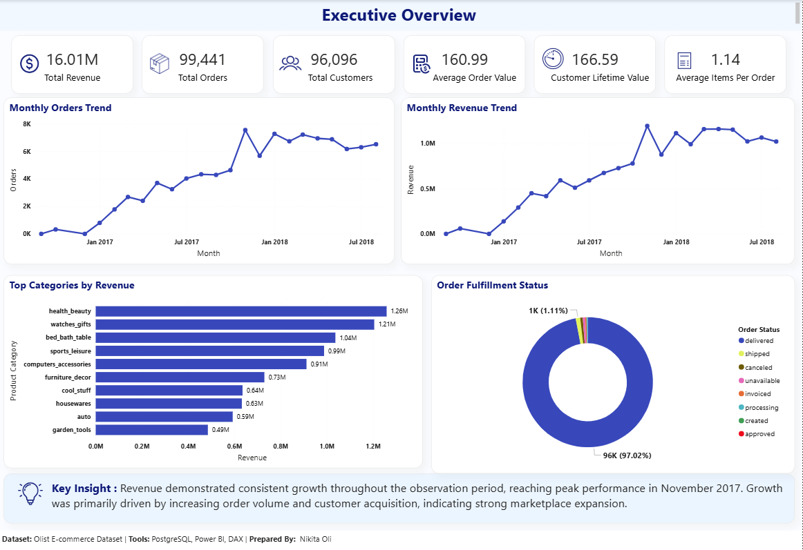
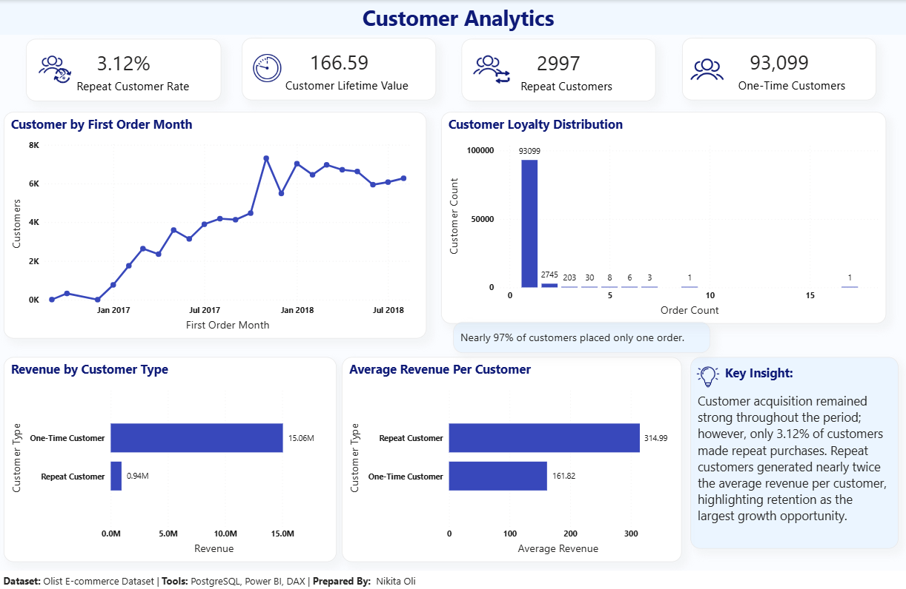
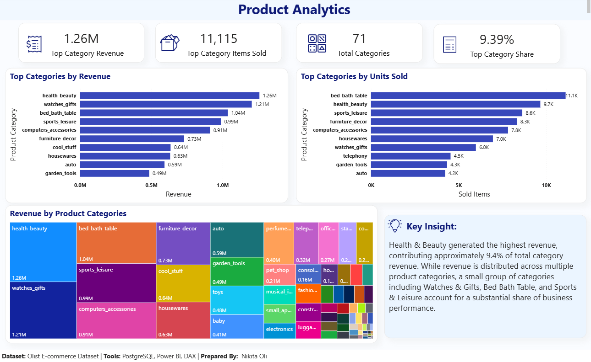
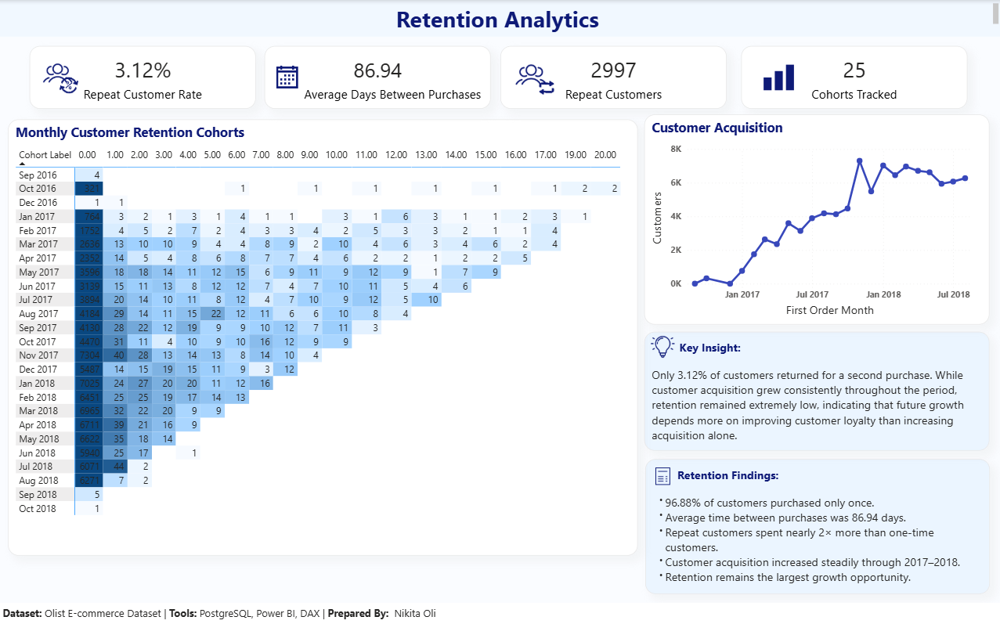

# E-Commerce Product & Customer Analytics Dashboard

## Project Overview

This project analyzes customer behavior, product performance, revenue trends, and customer retention using the Olist E-Commerce dataset. The objective is to identify business growth opportunities through customer analytics, product analytics, and retention analysis.

## Tools Used

* PostgreSQL
* SQL
* Power BI
* DAX

## Dataset

Source: Olist Brazilian E-Commerce Dataset

The dataset contains:

* 100K+ Orders
* 96K+ Customers
* 32K+ Products
* 16M+ Revenue Transactions

## Business Problems Addressed

* How has revenue changed over time?
* Which product categories generate the most revenue?
* What percentage of customers return to make additional purchases?
* What is the average customer lifetime value?
* How effective is customer retention?
* Which customer segments contribute the most revenue?

## SQL Analysis

The project includes:

* Revenue Analysis
* Customer Analytics
* Product Analytics
* Retention Analysis
* Cohort Analysis
* Customer Lifetime Value (CLV)
* Customer Revenue Segmentation

Advanced SQL concepts used:

* Joins
* Common Table Expressions (CTEs)
* Window Functions
* Aggregate Functions
* Views
* Date Functions

## Dashboard Pages

### 1. Executive Overview

* Total Revenue
* Total Orders
* Total Customers
* Average Order Value
* Customer Lifetime Value
* Revenue Trend
* Order Trend

### 2. Customer Analytics

* Repeat Customer Rate
* Customer Acquisition Trend
* Revenue by Customer Type
* Average Revenue per Customer
* Customer Loyalty Distribution

### 3. Product Analytics

* Revenue by Category
* Units Sold by Category
* Revenue Contribution Analysis
* Product Category Treemap

### 4. Retention Analytics

* Cohort Analysis
* Customer Acquisition Analysis
* Repeat Customer Metrics
* Customer Retention Insights

## Dashboard Preview

### Executive Overview

### Customer Analytics

### Product Analytics

### Retention Analytics

## Key Findings

* 96.88% of customers placed only one order.
* Repeat customers generated nearly 2× higher average revenue per customer.
* Health & Beauty was the highest revenue-generating product category.
* Revenue growth was primarily driven by customer acquisition.
* Customer retention remains the largest opportunity for business growth.

## Business Recommendations

* Implement customer loyalty programs to improve retention.
* Increase engagement with first-time customers through targeted campaigns.
* Focus marketing investments on high-performing product categories.
* Monitor retention metrics regularly using cohort analysis.

## Author

Nikita Oli
